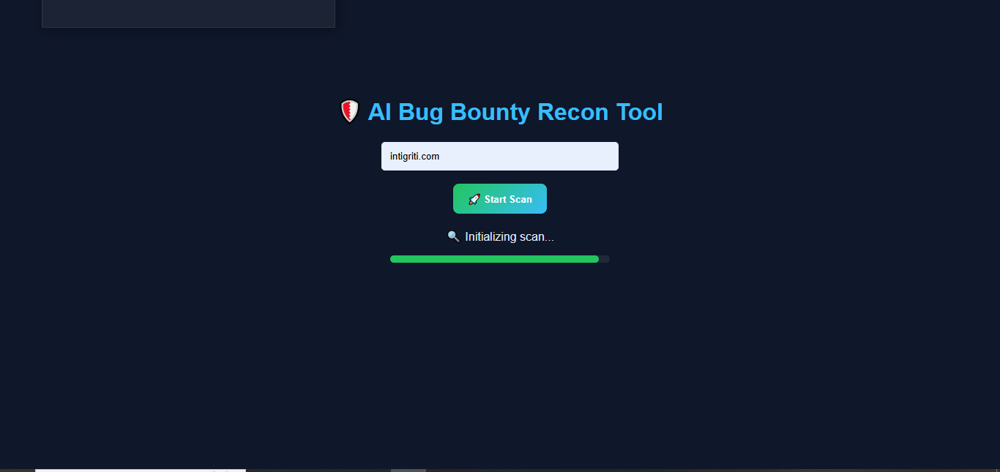
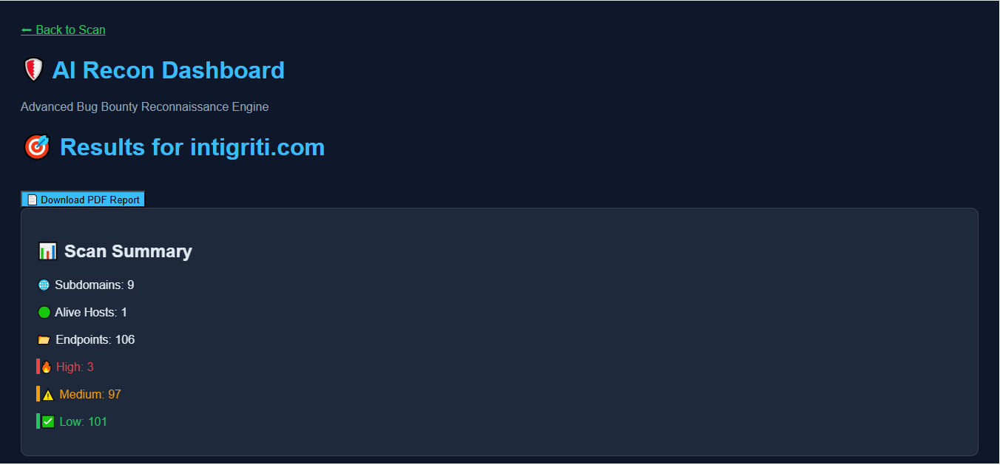
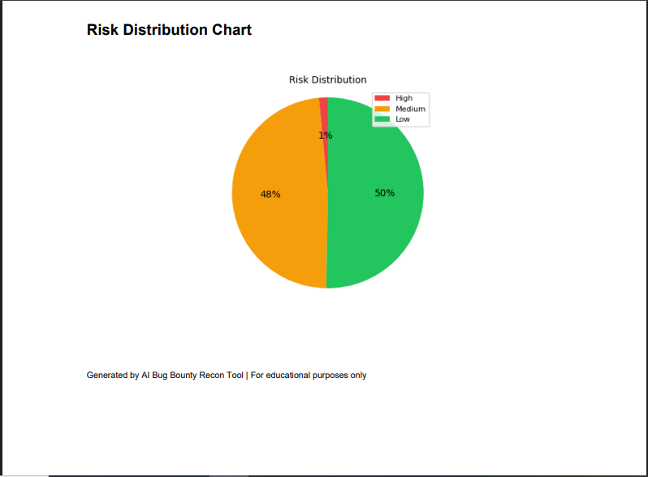
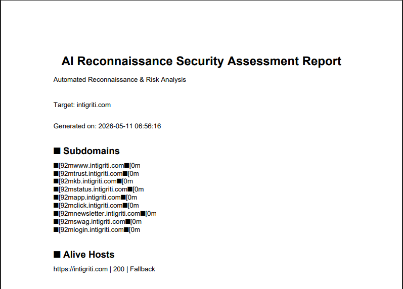

# 🛡️ AI Bug Bounty Recon Tool

An advanced AI-powered Bug Bounty Reconnaissance & Vulnerability Discovery platform built using Python, Flask, automation pipelines, intelligent endpoint analysis, exploit generation, and risk scoring.

---

# 🔥 Features

✅ Subdomain Enumeration  
✅ Live Host Detection  
✅ Port Scanning (Nmap)  
✅ JavaScript File Extraction  
✅ Secret & API Key Discovery  
✅ Wayback URL Harvesting  
✅ Parameter Discovery  
✅ Intelligent Endpoint Classification  
✅ Open Redirect Detection  
✅ XSS Detection  
✅ SQL Injection Testing  
✅ AI Risk Scoring Engine  
✅ Exploit PoC Generation  
✅ Automated Vulnerability Validation  
✅ PDF Report Generation  
✅ Interactive Dashboard UI  
✅ Risk Distribution Charts  
✅ Attack Priority Targeting  

---

# 🧠 Tech Stack

- Python
- Flask
- Requests
- BeautifulSoup
- ReportLab
- Chart.js
- Nmap
- httpx
- Sublist3r
- ThreadPoolExecutor

---

# 📸 Screenshots

## 🔍 Scan Dashboard



---

## 🚀 Scan Progress



---

## 📊 Risk Distribution



---

## 📄 Generated PDF Report



---

# ⚙️ Installation

## 1️⃣ Clone Repository

```bash
git clone https://github.com/BusyDetective/ai-bug-bounty-recon.git

cd ai-bug-bounty-recon
```

---

## 2️⃣ Create Virtual Environment

```bash
python3 -m venv venv

source venv/bin/activate
```

---

## 3️⃣ Install Requirements

```bash
pip install -r requirements.txt
```

---

## 4️⃣ Install Required Tools

### Ubuntu / Kali

```bash
sudo apt install nmap
pip install sublist3r
go install github.com/projectdiscovery/httpx/cmd/httpx@latest
```

---

# ▶️ Run The Tool

```bash
python3 dashboard/app.py
```

Then open:

```text
http://127.0.0.1:5000
```

---

# 🧪 Example Scan Targets

```text
intigriti.com
owasp.org
testphp.vulnweb.com
```

---

# 📄 Generated Reports

The tool automatically generates:

- Professional PDF reports
- Risk charts
- Exploit proof-of-concepts
- Prioritized attack targets

---

# ⚠️ Disclaimer

This project is created for:

- Educational purposes
- Security research
- Authorized penetration testing

Do NOT scan targets without proper permission.

---

# 👨‍💻 Author

Kaivan Shah

Cybersecurity Enthusiast | Bug Bounty Hunter | Python Developer

GitHub:
https://github.com/BusyDetective

---

# ⭐ Support

If you like this project:

⭐ Star the repository  
🍴 Fork the project  
🚀 Contribute improvements
